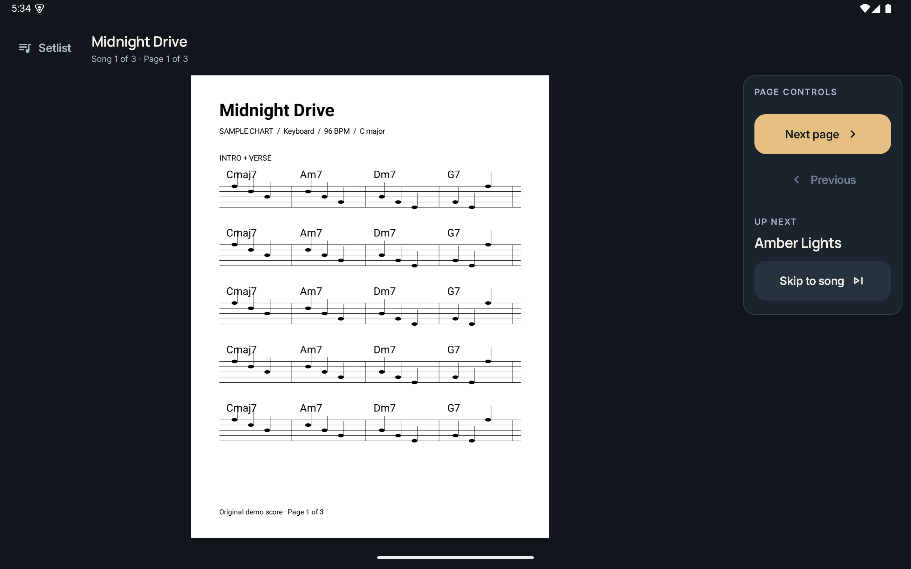
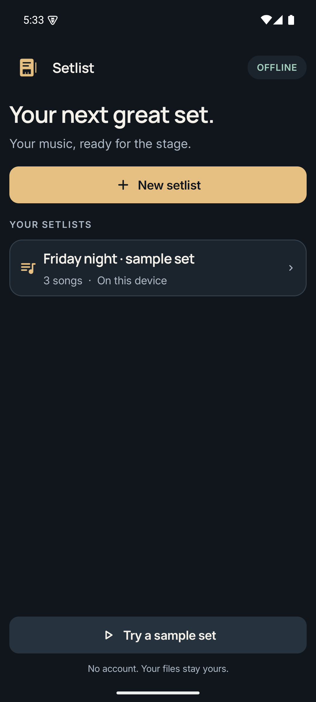
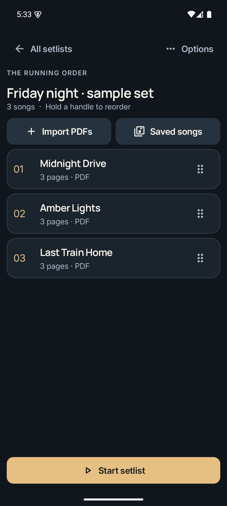
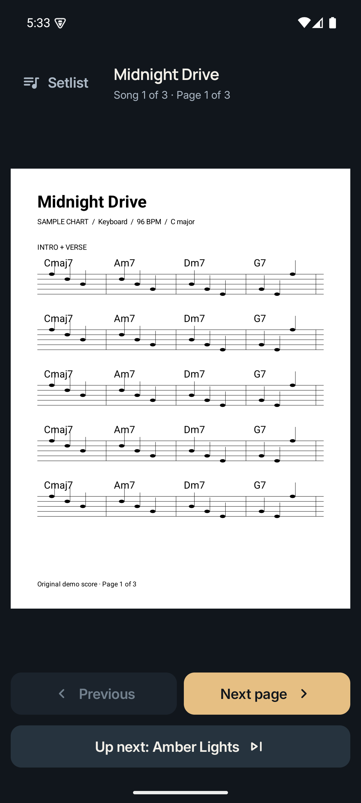
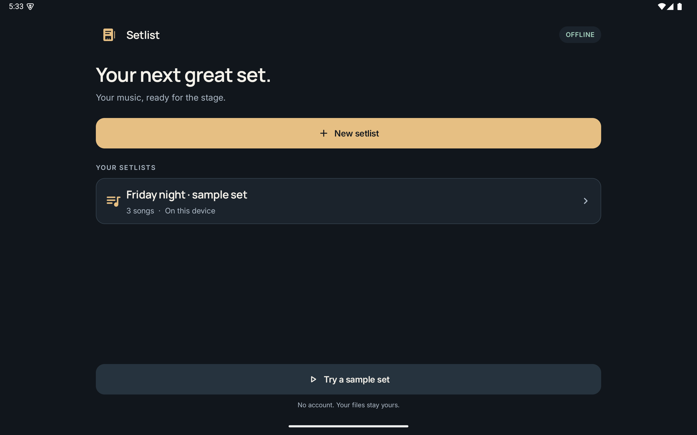

# Setlist

A native Android app for a keyboard player's concert setlists. Offline, with a
dark-stage design system: ink surfaces, warm amber controls, and readable scores.

<p align="center">
  
</p>

## Download

[Download Setlist 0.0.1 for Android](https://github.com/dataandops/setlist/releases/download/v0.0.1/Setlist-0.0.1.apk)

[Installation instructions to share with a friend](docs/INSTALL.md). Android 8.0+;
no computer or GitHub account needed. This is a directly distributed APK.

## Screenshots

Build a setlist, put the songs in playing order, then play straight through the
set. Swipe or tap to turn pages; at the end of a song, the same gesture takes you
into the next one.

<table>
  <tr>
    <td align="center"><br><sub>Your setlists</sub></td>
    <td align="center"><br><sub>The running order</sub></td>
    <td align="center"><br><sub>On stage</sub></td>
  </tr>
</table>

On a tablet, the same app gives the score more room:

<table>
  <tr>
    <td align="center"><br><sub>Home</sub></td>
    <td align="center"><br><sub>Editor</sub></td>
  </tr>
  <tr>
    <td align="center" colspan="2"><br><sub>Reader in portrait</sub></td>
  </tr>
</table>

## Features

- Create, rename and delete setlists; add, remove and reuse songs.
- Select multiple PDFs from device storage. Filenames become editable song names.
- Open files **in place** using persistent Android document permissions. No
  permanent copies of imported PDFs or audio, no broad storage permissions.
- Drag songs to reorder, or use Move up / Move down in song options.
- Stable song and setlist-entry IDs, stored in SQLite.
- Attach audio, inspect file references, and relink moved PDFs.
- Generate an original sample set to explore the app without supplying files.

- Start on the first score, move through pages, and advance into the next song.
- Jump to any song from the concert setlist picker; return to editing at any time.
- Render pages off the main thread, with bounded RAM caching and lookahead.
- Play, pause and seek MP3s; audio stops when leaving a song or the reader.
- Keep the screen awake during a set, with optional keyboard/pedal navigation.

See [the emulator guide](docs/EMULATOR.md) to try the app without a device and
[validation results](docs/VALIDATION.md) for tests and performance limits.

## Build

Requires JDK 17 and an Android SDK with platform 35. Open this directory in Android
Studio, or set `sdk.dir` in the ignored `local.properties` file, then run:

```sh
./gradlew assembleDebug lintDebug
./gradlew connectedDebugAndroidTest
```

The debug APK is `app/build/outputs/apk/debug/app-debug.apk`. Android 8.0+ (API 26).
The test suite requires a running Android emulator. SDK/tool downloads are not
checked into Git. The Gradle wrapper and dependency versions are pinned.

## Design and implementation

- [Design system](docs/DESIGN.md)
- [Implementation stages](docs/PLAN.md)
- [Emulator setup and usage](docs/EMULATOR.md)
- [Validation and performance](docs/VALIDATION.md)
- Shared palette: `app/src/main/res/values/colors.xml`
- Shared dimensions: `app/src/main/res/values/dimens.xml`
- Native components and type scale: `app/src/main/java/com/setlist/Ui.java`

The app has no Internet permission and no cloud backup. Original files must stay
available at their selected locations. Local document providers with seekable
file descriptors are supported; cloud-only/streaming documents should first be
saved to the device. Unprotected PDFs only. Removing a setlist keeps saved songs
available for reuse and never deletes source files.

### Dark stage preview

The Material 3 design uses bundled Manrope/Inter fonts, rounded symbols and a custom adaptive piano/setlist icon. Saved songs can be searched by title, artist, key, BPM, notes and file metadata, with a source-setlist filter. Edit metadata from a song’s options. See [the design system](docs/DESIGN.md). Debug builds install separately as **Setlist Preview**.
