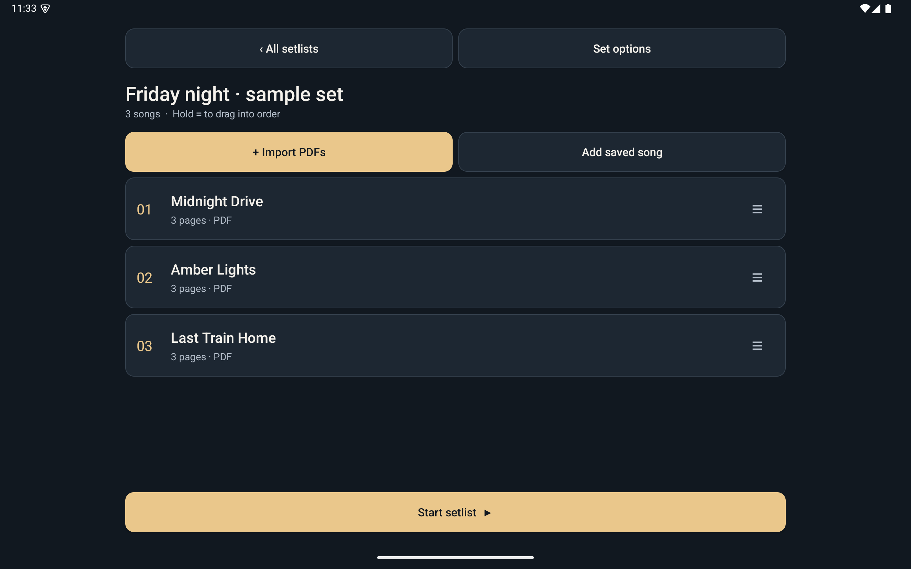
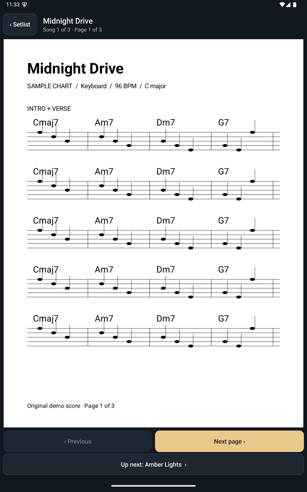

# Setlist design

- Native, offline Android app for a keyboard player preparing and performing concerts.
- Primary actions: assemble a running order, then turn pages with confidence.
- Calm, readable, stage-friendly controls with a warm accent.
- Phone and tablet, portrait and landscape; no account or network required.

## Visual system

Typography: Android sans, 14 sp supporting text, 16 sp body, 20 sp song titles,
28 sp headings, 36 sp home title. Line spacing 1.15. Spacing: 4/8/12/16/24/32 dp.
Background #111820, surface #1D2732, primary #EAC78B, text #F5F2EC,
muted #B4BECA, error #FFB4AB. Primary buttons use dark text on warm accent.
Rounded 12 dp cards; no decorative shadows. Platform ripple and focus states.

Single-column list, full-width score, max 960 dp editor width on tablets.
Comfortable density and 48 dp minimum touch targets. Below 600 dp use a
compact header; at 600 dp and above allow wider controls. The score always
fits the available viewport with its aspect ratio preserved.

Pre-code check: clear hierarchy within three seconds: yes; at most two focal
points: yes; consistent spacing: yes; AA text contrast: yes.

Empty, importing, loading, failed-document and finished-set states use plain
instructions. Reordering includes accessible move-up/down alternatives.

## Component rules

| Component | Rule |
| --- | --- |
| Primary action | Amber fill, ink label, 56 dp minimum height; reserve for the next meaningful action |
| Secondary action | Surface fill, 1 dp outline, warm white label |
| Song row | 12 dp radius, 16 dp inset, amber order number, title + file metadata, 48 dp drag affordance |
| Setlist card | Title first, song count second; entire surface is an accessible target |
| Page controls | Fixed position, explicit labels; next page becomes next song only at the song boundary |
| Status | Muted for context, amber for progress, pale red for failure; always include words |
| Score | White PDF page at original aspect ratio against the ink canvas |

Buttons and cards share pressed/focus ripples. Disabled buttons use neutral
surfaces and muted labels. Editor names wrap; the reader limits its title to two lines to preserve score space. Body
text respects system font scaling. No decorative motion in the concert view.

The source of truth for color is `res/values/colors.xml`; dimensions live in
`res/values/dimens.xml`; `Ui.java` implements the native components and named
caption/body/title/heading/display scale. New screens use these components.

### Tablet editor

### Portrait tablet reader

### Phone layouts

[Phone editor](screenshots/phone-editor.png) · [Phone reader](screenshots/phone-reader.png)

Validation: signed release screenshots reviewed on the Android 15 tablet in
portrait and landscape and on the portrait phone. Checks covered text contrast,
target spacing, consistent geometry, score aspect ratio and visible navigation.
Automated rotation tests confirm page preservation and subsequent page/song turns
on both device profiles. TalkBack and large-font physical-device checks remain
part of acceptance testing.
